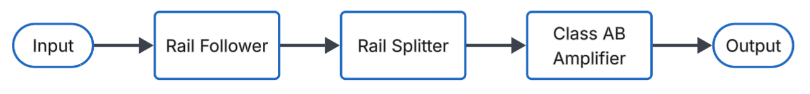

# Class-H-Amplifier

# Project Overview
This project aims to develop a lower-cost Class H amplifier design that can be used not only for audio, but other applications as well with little-to-no modification required. The design is based around a class AB amplifier like many reference designs. This amplifier design includes  documentation on testing and simulations to allow for easy replicability and modification. Key specifications and their impact on performance have been researched and were used to guide the design process. The design has been broken up into sections and most have been successfully simulated. These sections are shown in the block diagram.

# Methodology
The class H amplifier was broken down into sections to design separately that would fit together in the end. A class H amplifier differs from other amplifier classes due to its modulating supply rails [1]. A class AB amplifier was frequently used in reference designs and is commonly used especially in audio applications, leading that class to be the choice for this design as well. 

Specifications were defined throughout the process, both to guide the design and to evaluate the actual performance of the completed design. Common amplifier specifications listed on commercial designs include those shown in Table 1, including more which do not apply, are difficult to set a target for,  or are not easily testable. Target values were defined based on typical values and on what was a reasonable goal for this project. The specifications and their values are listed in the table below. 

| Specification | Target |
|--------------|--------|
| Maximum Output Power (Avg) | 100 W |
| Load Impedance | 8 Ω |
| Supply | ±6–45 V |
| Frequency Response | 20 Hz – 20 kHz |
| Total Harmonic Distortion (THD) | < 1% @ 1 kHz |
| Total Harmonic Distortion + Noise (THD+N) | < 1% @ 1 kHz |
| Signal to Noise Ratio (SNR) | ≥ 70 dB |
| Slew Rate | ≥ 5 V/µs |
| Efficiency | > 50% |
| Protection | Overvoltage, undervoltage, reverse polarity, undercurrent |

The full methodology is explained in more detail in the [project report](https://github.com/OSHE-Github/Class-H-Amplifier/blob/main/Documents/Class%20H%20Report.pdf).

# Bill of Materials
### Rail Follower
| Part Description                         | Part Number              | Quantity | Unit Cost | Total Cost |
|-----------------------------------------|--------------------------|----------|-----------|------------|
| 3.3 µH Sepic Inductor                   | ETQ-P8M3R3JFA            | 2        | $2.34     | $4.68      |
| 1 µF Sepic Medium Frequency Cap         | CL31B105KCHNFNE          | 50       | $0.10     | $5.21      |
| MOSFET N-Channel 100V                  | SIR870DP-T1-GE3          | 1        | $3.23     | $3.23      |
| 120 V 20A Output Diode                 | FSV20120V                | 1        | $1.30     | $1.30      |
| 10 mΩ 3W Shunt Resistor                | CRA2512-FZ-R010ELF       | 2        | $0.55     | $1.10      |
| 0.22 µF Soft Start Capacitor           | C3216X7R2A224K115AA      | 1        | $0.26     | $0.26      |
| 44.2 kΩ Rt Resistor                    | CRCW040244K2FKEDC        | 3        | $0.10     | $0.30      |
| 10 kΩ Resistor                         | RC0402FR-0710KL          | 4        | $0.10     | $0.40      |
| 22 kΩ Comp Resistor                    | ERA-2AEB223X             | 1        | $0.10     | $0.10      |
| 4700 pF Comp Capacitor                 | GRM155R72A472KA01D       | 1        | $0.10     | $0.10      |
| 330 µF Output Filter Capacitor         | EKXJ161ELL331MK50S       | 4        | $2.98     | $11.92     |
| Test Points                            | 36-5000-ND               | 7        | $0.28     | $1.96      |
| XT-30                                  | FIT0586                  | 2        | $1.90     | $3.80      |
| 7.5 kΩ Resistor                        | ERA-2AEB752X             | 3        | $0.10     | $0.30      |
| 110 kΩ Resistor                        | 311-110KLRCT-ND          | 1        | $0.10     | $0.10      |
| 10 µF ±10% 50V Input Capacitors        | CL31A106KBHNNNE          | 10       | $0.21     | $2.10      |
| TL072CDT Op-Amp                        | TL072CDT                 | 1        | $0.37     | $0.37      |
| 10 kΩ Potentiometer                    | PDB181-K220K-103B        | 1        | $1.40     | $1.40      |
| Signal Rectifier                       | BAS4002ARPPE6327HTSA1    | 1        | $0.32     | $0.32      |
| 3.5mm Audio Jack                       | SJ1-3523N                | 1        | $0.91     | $0.91      |

### Rail Splitter
| Part Description                         | Part Number                          | Quantity | Unit Cost | Total Cost |
|-----------------------------------------|--------------------------------------|----------|-----------|------------|
| Half-Bridge Gate Driver IC              | IRS21531DSTRPBFCT-ND                 | 2        | $1.24     | $2.48      |
| MOSFET N-CH 100V                        | SIR870DP-T1-GE3CT-ND                 | 4        | $3.23     | $12.92     |
| AD820ARZ Op-Amp                         | 505-AD820ARZ-ND                      | 2        | $9.11     | $18.22     |
| 10 µH Inductor                          | PCD2433CT-ND                         | 5        | $1.13     | $5.65      |
| Zener Diode                             | 1655-SK56BCT-ND                      | 5        | $0.49     | $2.45      |
| 5.6 kΩ 0.1% 1/10W                       | YAG1699CT-ND                         | 10       | $0.06     | $0.59      |
| 1 nF 1% 25V                             | 399-C0603C102F3GACTUCT-ND            | 10       | $0.50     | $5.04      |
| 10 µF ±20% 100V                         | 490-GRM32EC72A106ME05KCT-ND          | 15       | $0.64     | $9.56      |
| 10 µF ±10% 25V                          | 399-11939-1-ND                       | 10       | $0.13     | $1.26      |
| 470 µF 100 V                            | 493-1379-ND                          | 10       | $1.09     | $10.92     |
| 47 µF 100 V                             | 493-1147-ND                          | 10       | $0.28     | $2.80      |
| 10k Trimmer Pot                         | TC33X-103ECT-ND                      | 3        | $0.25     | $0.75      |
| 2200 pF ±20% 25V Ceramic                | 399-C0603C222M3RACTUCT-ND            | 10       | $0.15     | $1.47      |
| 0.1 µF ±10% 25V Ceramic                 | 399-C0603C104K3RACTUCT-ND            | 10       | $0.01     | $0.10      |
| 33 kΩ ±0.1% 0.1W                        | P33KDBCT-ND                          | 10       | $0.06     | $0.61      |
| 330 Ω ±5% 0.1W                          | 311-330GRCT-ND                       | 10       | $0.02     | $0.20      |
| 3.9 kΩ ±1% 0.1W                         | RMCF0603FT3K90CT-ND                  | 10       | $0.01     | $0.06      |
| 12 kΩ ±0.1% 0.1W                        | P12KDBCT-ND                          | 10       | $0.06     | $0.61      |
| 3.3 kΩ ±1% 0.1W                         | RMCF0603FT3K30CT-ND                  | 10       | $0.01     | $0.06      |
| 82 kΩ ±5% 0.1W                          | 311-82KGRCT-ND                       | 10       | $0.01     | $0.07      |
| 4.7 kΩ ±1% 0.1W                         | RMCF0603FT4K70CT-ND                  | 10       | $0.01     | $0.06      |
| 10 Ω ±1% 0.1W                           | RMCF0603FT10R0CT-ND                  | 10       | $0.01     | $0.06      |
| 1.5 kΩ ±1% 0.25W                        | RHM1.50KADCT-ND                      | 10       | $0.08     | $0.75      |
| Test Point                              | 36-5005-ND                           | 30       | $0.26     | $7.68      |

### Class AB Amplifier
| Part Number                         | Part Description                     | Quantity | Unit Cost | Total Cost |
|------------------------------------|-------------------------------------|----------|-----------|------------|
| 296-41370-2-ND                     | OPA454 Op-Amp                       | 1        | $7.18     | $7.18      |
| MJL21193GOS-ND                     | Output PNP BJT 250 V 16 A           | 1        | $6.26     | $6.26      |
| MJL21194GOS-ND                     | Output NPN BJT 250 V 16 A           | 1        | $6.26     | $6.26      |
| MJE15033GOS-ND                     | Driver PNP BJT 250 V 8 A            | 2        | $2.10     | $4.20      |
| MJE15032GOS-ND                     | Driver NPN BJT 250 V 8 A            | 2        | $2.10     | $4.20      |
| TTC004BQ-ND                        | NPN 160V 1.5A                       | 3        | $0.90     | $2.70      |
| TTA004BQ-ND                        | PNP 160V 1.5A                       | 2        | $0.81     | $1.62      |
| 541-WSLF3222L4000FE6CT-ND          | Output Emitter Resistors 12W         | 2        | $3.01     | $6.02      |
| 541-CRCW080540K0FKEACT-ND          | 40 kΩ Resistor 1/4W                 | 2        | $0.12     | $0.24      |
| 541-4187-1-ND                      | 20 kΩ Resistor 1/4W                 | 1        | $0.10     | $0.10      |
| 541-1.00KCCT-ND                    | 1 kΩ Resistor 1/4W                  | 2        | $0.10     | $0.20      |
| 541-1.10KCCT-ND                    | 1.1 kΩ Resistor 1/4W                | 1        | $0.10     | $0.10      |
| 311-3.60KFRCT-ND                   | 3.6 kΩ Resistor 1/4W                | 1        | $0.10     | $0.10      |
| 541-100CCT-ND                      | 100 Ω Resistor 1/4W                 | 3        | $0.10     | $0.30      |
| 709-VPDD202W102K1GV001ECT-ND       | 1 nF Filter Capacitor               | 1        | $0.17     | $0.17      |
| 399-C1206C104K5RACTUCT-ND          | 0.1 µF Bypass Capacitors            | 2        | $0.08     | $0.16      |
| 478-12065A300JAT2ACT-ND            | 30 pF Capacitor                     | 1        | $0.28     | $0.28      |
| 1712-CRGH1206F330RCT-ND            | 330 Ω Resistor 1/2W                 | 1        | $0.10     | $0.10      |
| 118-PV36W102C01B00-ND              | 1 kΩ Potentiometer                  | 1        | $1.53     | $1.53      |

## Enclosure
| Part Description                          | Qty | Link        | Cost  |
|-------------------------------------------|-----|------------|-------|
| #2 x 1/4" Pan Head Sheet Metal Screw      | 12  | [Link](https://www.amazon.com/dp/B094XVJRQB?ref=cm_sw_r_cso_cp_apin_dp_TH6723NY6FKN1X2NP8HY&ref_=cm_sw_r_cso_cp_apin_dp_TH6723NY6FKN1X2NP8HY&social_share=cm_sw_r_cso_cp_apin_dp_TH6723NY6FKN1X2NP8HY&oas=true)  | $7.49 |
| 3mm x 20mm Hex Bolt                       | 4   | [Link](https://www.amazon.com/BNUOK-Socket-Screws-Threads-Spanner/dp/B0DJR2Q5LP/ref=sr_1_3?crid=W2305ZD2FNQV&dib=eyJ2IjoiMSJ9.P3m1jdOV6NjRNryhqc6mNZYJ_rSOVjPZwx3x_IZUzmfyR4svjfvJ8AZDbHj88V6uT6GKq76S7kONkJRhTa5xslJtBGZexPCsansF_fme_kHCfzFpS4c3M_CYCkMVQ_ypZ0WC17a0_ok_aXVGSjp6NNtctOxYpODZq_4g6q-cFWu1m7xF6YFGcT4afU0DKKKk5LrJtV_EwZtWg0IahqVlrof1_2IzW9kSKOxP0gJua7HT48TAWBmCF_ZQ22wekv2fIo_w5N-S9Ny5Abupu7aoxaTT8c5O8pXYQZHBffv8LWM.cO3imLAJvC58IygrIHBa3FQS2-P8iiNmOXqj3alLTTM&dib_tag=se&keywords=20mm%2Bby%2B3mm%2Bbolt&qid=1776456512&s=industrial&sprefix=20mm%2Bby%2B3mm%2Bbol%2Cindustrial%2C128&sr=1-3&th=1)  | $7.49 |
| M3-0.5mm Hex Nut                          | 4   | [Link](https://www.amazon.com/ZQZ-M3-0-5mm-Stainless-Hardware-Standard/dp/B0CQJK2R5T/ref=sr_1_1_sspa?crid=3UUTX6CCJ48UD&dib=eyJ2IjoiMSJ9.oMLvADkOWoV2tdSD99yJKn77P0sYpqhahu07OuJaMVkT508_3DnS36jHQzzZcHaUcGwyuyrUUh6WKSawD0OY-kWypDtqByUyagUa8YG9794kMQc0sju8xYS97ldZXOMoD6u6WHuXXNEtnw-eQlqEG0MCaJLsESe1SBe6NfDM2q7kQrNBBYxnpDQhaXQ0WjLJOGpQ7I9LhlCe8ay9Hv0y8ibHUIxIMg4l7bJQl-S25i2cHnJW84qivJMa57IFFInZ1vuLvxHl58jHhJaIxB-g1VpELbbkeuYo2Ii8aOXYYqE.eCEfIdI_MtNjLMBC5TwFn8KkcLCQMYQUdiLAK9wA-Sc&dib_tag=se&keywords=M3%2Bnut&qid=1776456979&s=industrial&sprefix=m3%2B%2Cindustrial%2C248&sr=1-1-spons&sp_csd=d2lkZ2V0TmFtZT1zcF9hdGY&th=1)  | $9.99 |

# Tools Used
| Part Description | Part Number | Cost |
|------------|------------------|----------|
| Soldering Iron | FX888DX-010BY | $122.99 |
| Oscilliscope | DSOX2004A |  $3306.90 |
| B07BR3F9N6 | 3D Printer |  $169.00 |

Software:
- [LTspice](https://www.analog.com/en/resources/design-tools-and-calculators/ltspice-simulator.html)
- [KiCAD](https://www.kicad.org/download/)
  
# Assembly Overview
1. Gather materials specified in BOM
2. Order materials using provided Gerber files
3. Solder componenents on PCB as specified by schematics
4. Test as described in the [testing procedure](https://github.com/OSHE-Github/Class-H-Amplifier/blob/main/Documents/Testing%20Procedure.md)
5. Dowload enclosure files
6. 3D print enclosure
7. Secure PCBs in enclosure

Detailed assembly guide, including details on LTspice simulations can be found in the [project report](https://github.com/OSHE-Github/Class-H-Amplifier/blob/main/Documents/Class%20H%20Report.pdf)

# Future Recommendations
1. Further testing  for the final rendition of the rail follower board separately and the combination of the rail follower, rail splitter, and AB amplifier
2. Improve distortion, potentially through modification on rail splitter board
3. Further testing is needed for that to understand its maximum load conditions and how those can be improved
4. Additional testing with distortion using more precise equipment or measurement techniques

# References
[1] N. Utomo et al., “An 85.1% Peak Efficiency, Low Power Class H Audio Amplifier With Full Class H Operation,” *IEEE Transactions on Circuits and Systems I: Regular Papers*, vol. 70, no. 12, pp. 1–13, 2023. doi: 10.1109/TCSI.2023.3305622.

[2] S. Munz, “Slew Rate in Audio Amplifiers - What Does it Mean?,” *Audioholics*, Feb. 08, 2013.  
https://www.audioholics.com/audio-amplifier/amplifier-slew-rate

[3] Cambridge Audio, “Amplifier Specifications,” *Cambridge Audio*.  
https://www.cambridgeaudio.com/usa/en/blog/amplifier-specifications

[4] “What is Total Harmonic Distortion (THD)?,” *Audiophile On*, Aug. 16, 2025.  
https://www.audiophileon.com/news/what-is-total-harmonic-distortion-thd

[5] V. Batra, “Modular Concepts: What is an Envelope Follower?,” *Perfect Circuit*, Aug. 22, 2024.  
https://www.perfectcircuit.com/signal/envelope-followers

[6] “What’s the difference between MOSFET and BJT and how to choose?,” *NextPCB*.  
https://www.nextpcb.com/blog/what-is-the-difference-between-mosfet-and-bjt-and-how-to-choose

[7] A. Sedra and K. Smith, *Microelectronic Circuits*. Oxford University Press, 2019.

[8] O. Jørgensen, “What do different amplifier classes mean?,” *Dynaudio*, May 14, 2025.  
https://dynaudio.com/magazine/2025/may/amplifier-classes-ask-the-expert

[9] D. Self, *Audio Power Amplifier Design*, 6th ed. Elsevier / Focal Press, 2013.

[10] Cadence PCB Solutions, “What is Signal to Noise Ratio and How to calculate it?,” 2023.  
https://resources.pcb.cadence.com/blog/2020-what-is-signal-to-noise-ratio-and-how-to-calculate-it

[11] “OSHW,” *Freedom Defined*, 2023.  
https://freedomdefined.org/OSHW

This was also used as a general reference for various amplifier topics and designs that were not directly referenced in this report:

[12] B. Cordell, *Designing Audio Power Amplifiers*. McGraw-Hill Professional, 2010.
